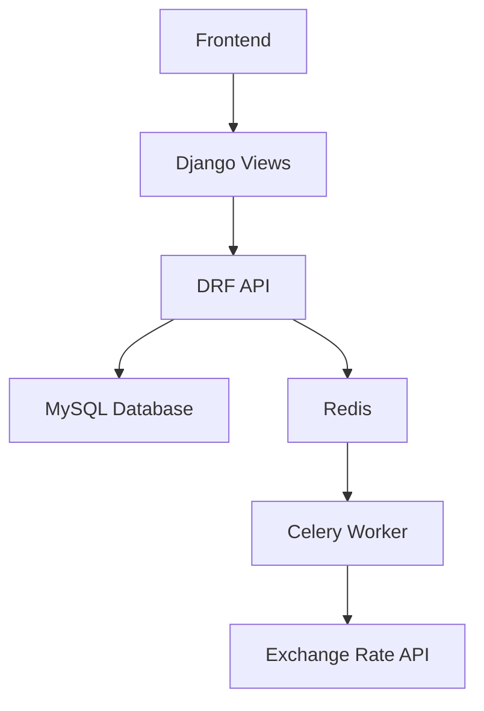

# Subscription Management System with Currency Exchange Tracker


A Django-based system for managing subscriptions with currency exchange rate tracking, featuring:
- REST API endpoints
- Celery background tasks
- MySQL database
- Redis broker
- Bootstrap frontend
- Dockerized deployment

## Features

- **User Subscription Management**
  - Create/view/cancel subscriptions
  - Multiple plan types
  - Status tracking (active/cancelled/expired)

- **Currency Exchange**
  - Real-time rate fetching
  - Historical rate logging
  - Hourly background updates

- **Admin Interface**
  - Full CRUD operations
  - Custom permission system
  - Staff can:
      - Add/Edit/Delete plans 
      - View user subscriptions 
      - View exchange logs 

## Prerequisites
- Docker Engine 20.10+
- Docker Compose 2.0+
- Python 3.12
- MySQL 8.0
- Redis 6.2

## Installation
### 1. Clone the repository
```bash
git clone https://github.com/MehediHasanNasim/Subscription-Manager.git
cd subscription-manager
```
### 2. Set up environment
```bash
cp .env.example .env
# Edit .env with your configurations
```
### 3. Start services
```bash
docker-compose up -d --build
```
### 4. Apply migrations
```bash
docker-compose exec web python manage.py migrate
```
### 5. Create superuser
```bash
docker-compose exec web python manage.py createsuperuser
```
### 🚀 API Endpoints
| Endpoint              | Method | Description               |
| --------------------- | ------ | ------------------------- |
| `/api/subscribe/`     | POST   | Create a new subscription |
| `/api/subscriptions/` | GET    | List user subscriptions   |
| `/api/cancel/`        | POST   | Cancel a subscription     |
| `/api/exchange-rate/` | GET    | Get current exchange rate |
#### Example Request:
```bash
curl -X GET "http://localhost:8000/api/exchange-rate/?base=USD&target=BDT"
```
#### Admin Access:
```bash
http://localhost:8000/admin/
```
#### Frontend Access:
```bash
http://localhost:8000/subscriptions/
```


## Local Development Setup (Non-Docker)
```bash
git clone https://github.com/yourusername/subscription-manager.git
cd subscription-manager
python -m venv venv

# On Windows:
venv\Scripts\activate
# On Mac/Linux:
source venv/bin/activate

pip install --upgrade pip
pip install -r requirements.txt
```
### Setup .env, Database Migrations, Start Services, Redis, Celery Worker
```bash
cp .env.example .env
# Edit .env with your configurations
```
```bash
python manage.py migrate
python manage.py createsuperuser
```
```bash
python manage.py runserver
```
```bash
redis-server
```
```bash
celery -A subscription_manager worker --loglevel=info --pool=solo
```
```bash
celery -A subscription_manager beat --loglevel=info --scheduler django_celery_beat.schedulers:DatabaseScheduler
```

## System Architecture




## System Walkthrough

### 1. Docker Setup Success


*Successful Docker build process*


*All containers running successfully*

### 2. Database Configuration

*Verified MySQL database connection*

### 3. Redis Integration

*Redis service connected and working with Celery*

### 4. Admin Interface Customization

*Customized Django admin interface*

### 5. Currency API Integration

*Live currency exchange rate API working*

### 6. Exchange Rate Logging


*Timestamped exchange rate logs in Django admin*

### 7. Frontend UI

*Bootstrap-powered subscription management interface*


